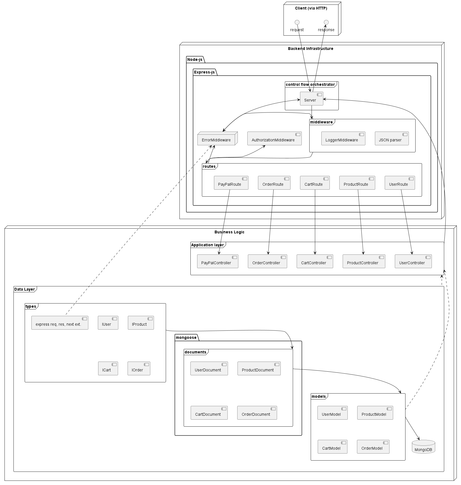

# e-commerce-backend

## Features
* A Node.js application exposes a RESTful API for a hypothetical e-commerce website.
* Technology stack: TypeScript, node, express, mongodb. Soon: Redux.
* Different authorization levels: Admin, authenticated users, non-authenticated users. Each has a different set of privileges / permissions, enforced by authorization middleware.

## API
See this project's Postman collection [documentation](https://documenter.getpostman.com/view/27173959/2s93eSaG8i).

## Actions
### Currently supported
* Create an account: Users are able provide name, email, password, and address. If the user does not exist (checked by email), a new user is created in a database. Passwords are hashed before being stored in the database.
* Log in: A user can authenticate to service via email and password. The API then returns a JWT (JSON Web Token) that can be used to authorize future requests.
* Create a product: An authenticated user provides a product name, description, price and an optional quantity, and it is inserted to a database.
* List products: Any user can view a paginated list of products, sorted in descending order by price. The user should also supply pageInput.

### Soon-to-be supported (Redux)
* Add a product to a cart: An authenticated user can provide a product ID and quantity. The product should be added to the user's cart, which is stored in the database.
* View a cart: Authenticated users can view the contents of their cart.
* Checkout: An authenticated user provides payment information. The API then confirms the purchase. The user's cart is then emptied, and a confirmation email is sent to the user.

## Usage
### nvm
Use [nvm](https://github.com/nvm-sh/nvm#profile_snippet) to load the project node version defined in `.env`. 

With nvm installed, execute `nvm use` or `nvm install`. This should switch or install the project nod version.

### Environment variables
Use an `.env` file with the following entries:
* `NODE_ENV`: When set to `development`, the [morgan](https://www.npmjs.com/package/morgan) logger middleware is used.
* `PORT`
* `MONGO_URI`: Used to connect to mango-db database.
* `JWT_SECRET`: Used for JWT token creation.

## Design docs
### Component Overview

    

## References

### Main resource
* O'Reilly Course: [MERN E-commerce from Scratch](https://learning.oreilly.com/videos/mern-e-commerce-from/9781801077545/) by Brad Traversy. Also see course GitHub repo: [proshop_mern](https://github.com/bradtraversy/proshop_mern). Written in JavaScript.
* GitHub repo: [TypeScript-MERN-Ecommerce](https://github.com/RdotSilva/TypeScript-MERN-Ecommerce). Similar to Brad's repo, but translated to TypeScript. Also adds testing.

### Other
* O'Reilly Course: [Modern JavaScript for the Impatient](https://learning.oreilly.com/videos/modern-javascript-for/9780135812778/) by Cay S. Horstmann.
* Plurasight path: [TypeScript Core Language](https://app.pluralsight.com/paths/skill/typescript-core-language). Specifically courses [1](https://app.pluralsight.com/library/courses/typescript-big-picture/table-of-contents), [2](https://app.pluralsight.com/library/courses/getting-started-typescript), [3](https://app.pluralsight.com/library/courses/typescript-creating-object-oriented-code/table-of-contents).