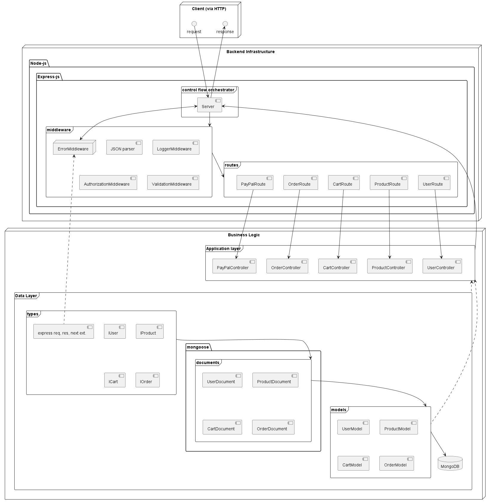

# e-commerce-backend

A Node.js application exposes a RESTful API for a hypotehtical e-commerce website.

A mongo-db database is used, and persistence between sessions is maintained.

## API
-Soon-

## Actions
### Currently supported:
1. Create an account: Users are able provide name, email, password, and address. If the user does not exist (checked by email), a new user is created in database. Passwords are hashed before being stored in the database.
2. Log in: A user can authenticate to service via email and password. The API then returns a JWT (JSON Web Token) that can be used to authorize future requests.
3. Create a product: An authenticated user provides a product name, description, price and an optional quantity, and it is inserted to database.
4. List products: Any user can view a paginated list of products, sorted in descending order by price. The user should also supply pageInput.

### Soon-to-be supported:
5.	Add a product to a cart: An authenticated user can provide a product ID and quantity. The product should be added to the user's cart, which is stored in the database.
6.	View a cart: Authenticated users can view the contents of their cart.
7.	Checkout: An authenticated user provides payment information and confirm their purchase. The user's cart is then emptied and a confirmation email is sent to the user.

## Usage
Use an `.env` file with the following entries:
* `NODE_ENV`: When set to `development`, the [morgan](https://www.npmjs.com/package/morgan) logger middleware is used.
* `PORT`
* `MONGO_URI`: Used to connect to mango-db database.
* `JWT_SECRET`: Used for JWT token creation.

## Design docs
### Component Overview

    

